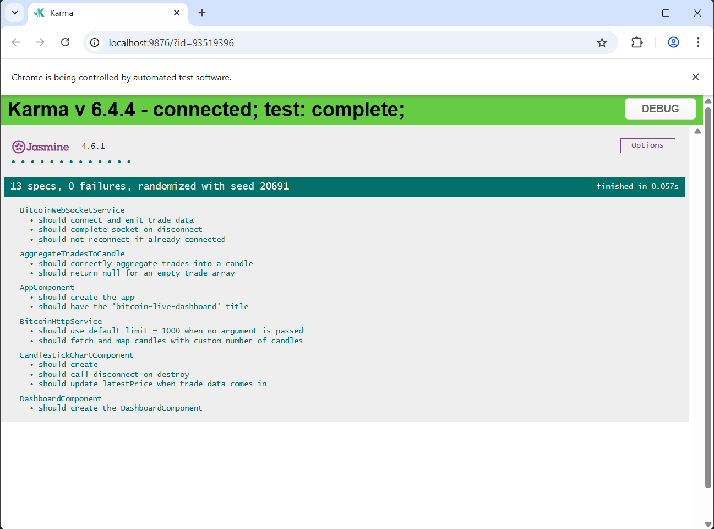

# Angular + WebSocket + Karma & Jasmin
## An Angular example using WebSocket with Karma & Jasmine unit tests

This project was generated using [Angular CLI](https://github.com/angular/angular-cli) version 19.0.6.


# 📈 Angular BTC Candlestick Chart

This project is a lightweight, modular Angular application that displays real-time **Bitcoin candlestick charts** using data from Binance. It integrates WebSocket streaming and supports unit testing with **Karma + Jasmine**.

---

## 🚀 Features

- 📡 **Live BTC/USDT trades** via WebSocket from Binance
- 🕯️ **Candlestick chart rendering** with `lightweight-charts`
- 🧪 **Unit tested** with Karma & Jasmine
- 🧩 **Standalone Angular components** (Angular 15+)
- ⚡ Clean and modular service structure (`Http`, `WebSocket`, `Aggregation`)

---

## 🧱 Tech Stack

- **Angular 15+** (Standalone Components)
- **RxJS** for reactive streams
- **Binance WebSocket API** for live trades
- **lightweight-charts** by TradingView
- **Karma + Jasmine** for unit testing
- **HttpClient** for historical candles

---

## 🧪 Testing

This project uses **Karma + Jasmine** for unit testing. Key areas covered:

- ✅ WebSocket message stream parsing
- ✅ Aggregation of `BinanceTrade[]` to OHLC candle
- ✅ HTTP calls to Binance REST API
- ✅ Dashboard component initialization

### 📦 Run Unit Tests

```bash
ng test


## Development server

To start a local development server, run:

```bash
ng serve
```



